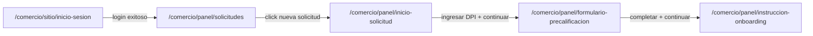

# Documento de Diseño — Automatización de Validaciones de Inputs B2C

## Visión General

Este diseño cubre la implementación de ~51 casos de prueba automatizados para validaciones de campos de entrada, labels de UI, contenido de modales y layout de formularios en el flujo B2C (Comercios) de Tarjeta Digital. Los tests se integran con la arquitectura existente del proyecto: Page Object Model con fixtures auto-inyectados, testing data-driven via JSON, y `ScreenshotHelper` para evidencia.

### Alcance

| Área | Pantallas cubiertas |
|------|-------------------|
| Login B2C | Campo usuario, campo contraseña, botón login |
| Nueva Solicitud | Campo DPI |
| Datos Generales | Email, NIT, Teléfono |
| Modal Instructivo | Título, subtítulo, imagen, bullets |
| Modal Error FacePhi | Título, cuerpo, botón, redirección |
| Login Actualizado (Parte 2) | Input email/CUI, estados visuales |
| Negocio Propio | Layout fecha inscripción / nombre comercial |
| Regresión Selphi 5.51 | Flujo onboarding E2E |

### Decisiones de Diseño

1. **Reutilizar Page Objects existentes** en vez de crear nuevos cuando la pantalla ya tiene un PO (`HomePageBusiness`, `EmpezarSolicitudBusinessPage`, `FormDatosGeneralesPage`, `InstruccionOnboardingBusinessPage`). Se agregan métodos nuevos a los PO existentes.
2. **Archivos spec separados por pantalla/funcionalidad** para mantener la granularidad y permitir ejecución selectiva por tags.
3. **Datos externalizados en JSON** siguiendo el patrón de `ui-expected-values.json` y `data/validations/`. Nunca hardcodear valores esperados en los tests.
4. **Tests de validación importan desde `@playwright/test`** directamente (excepción documentada en conventions.md) cuando no necesitan fixtures custom. Tests que requieren navegación completa (login + dashboard) usan `fixtures/baseTest.ts`.

---

## Arquitectura

### Diagrama de Componentes

```mermaid
graph TD
    subgraph "Archivos Spec (tests/validations/)"
        A1[ui/validateLabelsLoginB2C.spec.ts]
        A2[ui/validatePasswordB2C.spec.ts]
        A3[ui/validateBotonLoginB2C.spec.ts]
        A4[ui/validateDpiB2C.spec.ts<br/>ya existe - extender]
        A5[ui/validateEmailB2C.spec.ts]
        A6[ui/validateNitB2C.spec.ts]
        A7[ui/validateTelefonoB2C.spec.ts]
        A8[modal/validateModalInstructivo.spec.ts]
        A9[modal/validateModalErrorFacePhi.spec.ts]
        A10[ui/validateLoginActualizadoB2C.spec.ts]
        A11[ui/validateLayoutNegocioPropio.spec.ts]
        A12[regression/regresionSelphi551.spec.ts]
    end

    subgraph "Page Objects (pages/B2C/)"
        B1[home.page.ts<br/>+ métodos validación]
        B2[empezarSolicitud.page.ts<br/>+ métodos validación]
        B3[formDatosGenerales.page.ts<br/>+ métodos validación]
        B4[instruccionOnboardingBusiness.page.ts<br/>+ métodos modal]
    end

    subgraph "Datos (data/)"
        C1[ui-expected-values.json<br/>+ secciones nuevas]
        C2[validations/login-validations.json]
        C3[validations/email-validations.json]
        C4[validations/nit-validations.json]
        C5[validations/telefono-validations.json]
        C6[test-matrix.json<br/>+ escenarios nuevos]
    end

    A1 --> B1
    A2 --> B1
    A3 --> B1
    A4 --> B2
    A5 --> B3
    A6 --> B3
    A7 --> B3
    A8 --> B4
    A9 --> B4
    A10 --> B1
    A11 --> B3

    A1 --> C1
    A2 --> C1
    A5 --> C1
    A5 --> C3
    A6 --> C4
    A7 --> C5
    A8 --> C1
    A9 --> C1
    A10 --> C1
    A10 --> C2
```



### Flujo de Navegación para Tests



**Niveles de navegación requeridos por spec:**

| Spec | Navegación mínima |
|------|-------------------|
| Login (Req 1, 2, 3, 9) | Solo ir a `/comercio/sitio/inicio-sesion` |
| DPI (Req 4) | Login → Dashboard → Nueva Solicitud |
| Email, NIT, Teléfono (Req 5, 6, 7) | Login → Dashboard → Nueva Solicitud → DPI → Datos Generales |
| Modal Instructivo (Req 8) | Login → Dashboard → Nueva Solicitud → DPI → Datos Generales → Instrucción |
| Modal Error FacePhi (Req 12) | Login → Dashboard → Nueva Solicitud → DPI → Datos Generales → Instrucción (con dispositivo incompatible) |
| Layout Negocio Propio (Req 11) | Requiere llegar a sección datos económicos con "negocio propio" seleccionado |
| Regresión Selphi (Req 10) | Flujo completo E2E B2C |

---

## Componentes e Interfaces

### 1. Archivos Spec Nuevos

#### 1.1 `tests/validations/ui/validatePasswordB2C.spec.ts`
**Cubre:** Requerimiento 2 (Contraseña)
- Validar label y placeholder del campo contraseña
- Validar aceptación de texto alfanumérico
- Validar truncamiento o error a 60 caracteres

#### 1.2 `tests/validations/ui/validateBotonLoginB2C.spec.ts`
**Cubre:** Requerimiento 3 (Botón login)
- Validar estado deshabilitado con campos vacíos
- Validar estado habilitado con campos llenos
- Validar texto del botón
- Validar redirección exitosa al dashboard

#### 1.3 `tests/validations/ui/validateEmailB2C.spec.ts`
**Cubre:** Requerimiento 5 (Email)
- Validar label y placeholder
- Validar email válido sin errores
- Validar email inválido con mensaje de error
- Validar campo requerido

#### 1.4 `tests/validations/ui/validateNitB2C.spec.ts`
**Cubre:** Requerimiento 6 (NIT)
- Validar label y placeholder
- Validar NIT válido sin errores
- Validar NIT inválido con mensaje de error
- Validar campo requerido

#### 1.5 `tests/validations/ui/validateTelefonoB2C.spec.ts`
**Cubre:** Requerimiento 7 (Teléfono)
- Validar label y placeholder
- Validar campo requerido
- Validar teléfono inválido con mensaje de error

#### 1.6 `tests/validations/modal/validateModalInstructivo.spec.ts`
**Cubre:** Requerimiento 8 (Modal instructivo rediseñado)
- Validar ausencia de texto anterior
- Validar nuevo título, subtítulo
- Validar imagen SVG
- Validar contenido de bullets

#### 1.7 `tests/validations/modal/validateModalErrorFacePhi.spec.ts`
**Cubre:** Requerimiento 12 (Modal error FacePhi)
- Validar título "¡Lo sentimos!"
- Validar texto del cuerpo
- Validar texto del botón "¡Listo!"
- Validar redirección al hacer click

#### 1.8 `tests/validations/ui/validateLoginActualizadoB2C.spec.ts`
**Cubre:** Requerimiento 9 (Login actualizado Parte 2)
- Validar aceptación alfanumérica
- Validar truncamiento a 60 caracteres
- Validar aceptación de email y CUI
- Validar estados visuales (CSS)
- Validar label y placeholder actualizados
- Validar error de campo requerido

#### 1.9 `tests/validations/ui/validateLayoutNegocioPropio.spec.ts`
**Cubre:** Requerimiento 11 (Layout negocio propio)
- Validar posición vertical de campos fecha inscripción y nombre comercial

#### 1.10 `tests/validations/regression/regresionSelphi551.spec.ts`
**Cubre:** Requerimiento 10 (Regresión Selphi 5.51)
- Ejecutar flujo completo B2C y verificar que onboarding avanza sin errores

### 2. Archivos Spec Existentes a Extender

#### 2.1 `tests/validations/ui/validateLabelsB2C.spec.ts`
**Ya cubre parcialmente:** Requerimiento 1 (Usuario login)
- Ya tiene: VAL-UI-B2C-001 a VAL-UI-B2C-007
- **Agregar:** Test de aceptación alfanumérica (Req 1.4)

#### 2.2 `tests/validations/ui/validateDpiB2C.spec.ts`
**Ya cubre parcialmente:** Requerimiento 4 (DPI)
- Ya tiene: VAL-UI-DPI-001 a VAL-UI-DPI-008
- Los 8 criterios del Req 4 ya están cubiertos por los tests existentes

### 3. Métodos Nuevos en Page Objects

#### 3.1 `pages/B2C/home.page.ts` — `HomePageBusiness`

```typescript
// Métodos nuevos a agregar:
async obtenerValorCampoUsuario(): Promise<string>
async obtenerValorCampoPassword(): Promise<string>
async obtenerPlaceholderUsuario(): Promise<string | null>
async obtenerPlaceholderPassword(): Promise<string | null>
async estaBotonLoginHabilitado(): Promise<boolean>
async obtenerClasesCampoUsuario(): Promise<string | null>
async obtenerEstadoVisualCampo(testId: string): Promise<{ focused: boolean; filled: boolean; error: boolean }>
```

#### 3.2 `pages/B2C/formDatosGenerales.page.ts` — `FormDatosGeneralesPage`

```typescript
// Métodos nuevos a agregar:
async obtenerPlaceholderEmail(): Promise<string | null>
async obtenerPlaceholderNit(): Promise<string | null>
async obtenerPlaceholderTelefono(): Promise<string | null>
async llenarEmail(email: string): Promise<void>
async llenarNit(nit: string): Promise<void>
async llenarTelefono(telefono: string): Promise<void>
async limpiarCampo(testId: string): Promise<void>
```

#### 3.3 `pages/B2C/instruccionOnboardingBusiness.page.ts` — `InstruccionOnboardingBusinessPage`

```typescript
// Métodos nuevos a agregar:
async obtenerTituloModal(): Promise<string | null>
async obtenerSubtituloModal(): Promise<string | null>
async obtenerSrcImagenInstructiva(): Promise<string | null>
async obtenerTextoBullets(): Promise<string[]>
async esVisibleModalInstructivo(): Promise<boolean>
```

#### 3.4 Nuevo Page Object: `pages/B2C/modalErrorFacePhi.page.ts` — `ModalErrorFacePhiPage`

```typescript
export class ModalErrorFacePhiPage {
    readonly page: Page;
    constructor(page: Page) { this.page = page; }
    
    async obtenerTituloModal(): Promise<string | null>
    async obtenerTextoBody(): Promise<string | null>
    async obtenerTextoBoton(): Promise<string | null>
    async clickBotonListo(): Promise<void>
    async esVisibleModal(): Promise<boolean>
}
```

> Este PO nuevo debe registrarse en `fixtures/baseTest.ts` como fixture `modalErrorFacePhiPage`.

### 4. Fixtures — Actualización de `fixtures/baseTest.ts`

Agregar el nuevo fixture:

```typescript
import { ModalErrorFacePhiPage } from '../pages/B2C/modalErrorFacePhi.page';

// En CustomFixtures:
modalErrorFacePhiPage: ModalErrorFacePhiPage;

// En base.extend:
modalErrorFacePhiPage: async ({ page }, use) => {
    await use(new ModalErrorFacePhiPage(page));
},
```

---

## Modelos de Datos

### 1. Extensiones a `data/ui-expected-values.json`

Se agregan las siguientes secciones nuevas al JSON existente:

```json
{
  "loginB2C": {
    "...existente..."
  },
  "loginActualizado": {
    "inputLogin": {
      "label": "Usuario",
      "placeholder": "Ingresa tu correo electrónico o CUI",
      "testId": "login-page-business-card-form-user",
      "errorTestId": "login-page-business-card-form-user-required-error",
      "invalidErrorTestId": "login-page-business-card-form-user-error",
      "maxLength": 60,
      "errorMessages": {
        "required": "Este campo es obligatorio.",
        "maxLength": "El campo debe tener como máximo 60 caracteres."
      }
    }
  },
  "modalInstructivo": {
    "titulo": {
      "testId": "instruccion-onboarding-title",
      "text": "Texto del título actualizado"
    },
    "subtitulo": {
      "testId": "instruccion-onboarding-subtitle",
      "text": "Texto del subtítulo actualizado"
    },
    "imagen": {
      "testId": "instruccion-onboarding-image",
      "srcPattern": ".svg"
    },
    "bullets": {
      "testId": "instruccion-onboarding-bullets",
      "items": [
        "Bullet 1 actualizado",
        "Bullet 2 actualizado",
        "Bullet 3 actualizado"
      ]
    },
    "textoAnterior": "Texto instructivo anterior que ya no debe aparecer"
  },
  "modalErrorFacePhi": {
    "titulo": {
      "testId": "facephi-error-modal-title",
      "text": "¡Lo sentimos!"
    },
    "body": {
      "testId": "facephi-error-modal-body",
      "text": "Tu dispositivo o navegador no es compatible"
    },
    "boton": {
      "testId": "facephi-error-modal-button",
      "text": "¡Listo!"
    },
    "redirectPattern": "/comercio/sitio/inicio-sesion"
  },
  "negocioPropio": {
    "nombreComercial": {
      "testId": "negocio-propio-nombre-comercial",
      "label": "Nombre comercial"
    },
    "fechaInscripcion": {
      "testId": "negocio-propio-fecha-inscripcion",
      "label": "Fecha de inscripción de la empresa"
    }
  }
}
```

> **Nota:** Los `testId` y textos exactos de `modalInstructivo`, `modalErrorFacePhi` y `loginActualizado` deben confirmarse inspeccionando la aplicación en QA. Los valores aquí son placeholders basados en los requerimientos.

### 2. Nuevos Archivos de Validación en `data/validations/`

#### 2.1 `data/validations/login-validations.json`

```json
{
  "description": "Casos de prueba para validaciones del campo usuario login B2C",
  "field": "Usuario Login",
  "page": "login-b2c",
  "loginCases": [
    {
      "name": "Usuario alfanumérico válido",
      "testId": "LOGIN-VAL-001",
      "input": "usuario123",
      "shouldFail": false,
      "priority": "P1"
    },
    {
      "name": "Usuario con 30 caracteres (límite)",
      "testId": "LOGIN-VAL-002",
      "input": "eestrada@bi.com.gtaaaaaaaaaaaa",
      "shouldFail": false,
      "priority": "P1"
    },
    {
      "name": "Usuario con 31 caracteres (excede límite)",
      "testId": "LOGIN-VAL-003",
      "input": "eestrada@bi.com.gtaaaaaaaaaaaaa",
      "expectedError": "El campo debe tener como máximo 30 caracteres.",
      "shouldFail": true,
      "priority": "P1"
    }
  ]
}
```

#### 2.2 `data/validations/email-validations.json`

```json
{
  "description": "Casos de prueba para validaciones del campo email en datos generales B2C",
  "field": "Email",
  "page": "formulario-precalificacion",
  "emailCases": [
    {
      "name": "Email válido",
      "testId": "EMAIL-VAL-001",
      "input": "usuario@dominio.com",
      "shouldFail": false,
      "priority": "P1"
    },
    {
      "name": "Email inválido - sin arroba",
      "testId": "EMAIL-VAL-002",
      "input": "correo-invalido",
      "expectedError": "El correo electrónico no es válido.",
      "errorTestId": "general-information-form-email-error",
      "shouldFail": true,
      "priority": "P1"
    },
    {
      "name": "Email vacío",
      "testId": "EMAIL-VAL-003",
      "input": "",
      "expectedError": "Este campo es obligatorio.",
      "errorTestId": "general-information-form-email-required-error",
      "shouldFail": true,
      "priority": "P0"
    }
  ]
}
```

#### 2.3 `data/validations/nit-validations.json`

```json
{
  "description": "Casos de prueba para validaciones del campo NIT en datos generales B2C",
  "field": "NIT",
  "page": "formulario-precalificacion",
  "nitCases": [
    {
      "name": "NIT válido",
      "testId": "NIT-VAL-001",
      "input": "1234567",
      "shouldFail": false,
      "priority": "P1"
    },
    {
      "name": "NIT inválido",
      "testId": "NIT-VAL-002",
      "input": "abc",
      "expectedError": "El N.I.T. no es válido.",
      "errorTestId": "general-information-form-nit-error",
      "shouldFail": true,
      "priority": "P1"
    },
    {
      "name": "NIT vacío",
      "testId": "NIT-VAL-003",
      "input": "",
      "expectedError": "Este campo es obligatorio.",
      "errorTestId": "general-information-form-nit-required-error",
      "shouldFail": true,
      "priority": "P0"
    }
  ]
}
```

#### 2.4 `data/validations/telefono-validations.json`

```json
{
  "description": "Casos de prueba para validaciones del campo teléfono en datos generales B2C",
  "field": "Teléfono",
  "page": "formulario-precalificacion",
  "telefonoCases": [
    {
      "name": "Teléfono válido - 8 dígitos",
      "testId": "TEL-VAL-001",
      "input": "55551234",
      "shouldFail": false,
      "priority": "P1"
    },
    {
      "name": "Teléfono inválido - menos de 8 dígitos",
      "testId": "TEL-VAL-002",
      "input": "1234",
      "expectedError": "El número de celular no es válido.",
      "errorTestId": "general-information-form-phone-number-error",
      "shouldFail": true,
      "priority": "P1"
    },
    {
      "name": "Teléfono vacío",
      "testId": "TEL-VAL-003",
      "input": "",
      "expectedError": "Este campo es obligatorio.",
      "errorTestId": "general-information-form-phone-number-required-error",
      "shouldFail": true,
      "priority": "P0"
    }
  ]
}
```

### 3. Actualizaciones a `data/test-matrix.json`

Se agregan los siguientes escenarios nuevos a la sección `scenarios.validations`:

| ID | Nombre | Archivo | Prioridad | Tags |
|----|--------|---------|-----------|------|
| VAL-UI-PWD-001 | Validaciones UI - Contraseña B2C | tests/validations/ui/validatePasswordB2C.spec.ts | P1 | @validation, @ui, @B2C |
| VAL-UI-BTN-001 | Validaciones UI - Botón Login B2C | tests/validations/ui/validateBotonLoginB2C.spec.ts | P1 | @validation, @ui, @B2C |
| VAL-UI-EMAIL-001 | Validaciones UI - Email B2C | tests/validations/ui/validateEmailB2C.spec.ts | P1 | @validation, @ui, @B2C |
| VAL-UI-NIT-001 | Validaciones UI - NIT B2C | tests/validations/ui/validateNitB2C.spec.ts | P1 | @validation, @ui, @B2C |
| VAL-UI-TEL-001 | Validaciones UI - Teléfono B2C | tests/validations/ui/validateTelefonoB2C.spec.ts | P1 | @validation, @ui, @B2C |
| VAL-MODAL-INST-001 | Validaciones Modal Instructivo | tests/validations/modal/validateModalInstructivo.spec.ts | P1 | @validation, @modal, @B2C |
| VAL-MODAL-FP-001 | Validaciones Modal Error FacePhi | tests/validations/modal/validateModalErrorFacePhi.spec.ts | P1 | @validation, @modal, @B2C |
| VAL-UI-LOGIN2-001 | Validaciones Login Actualizado Parte 2 | tests/validations/ui/validateLoginActualizadoB2C.spec.ts | P1 | @validation, @ui, @B2C |
| VAL-UI-LAYOUT-001 | Validaciones Layout Negocio Propio | tests/validations/ui/validateLayoutNegocioPropio.spec.ts | P2 | @validation, @ui, @B2C |
| VAL-REG-SELPHI-001 | Regresión Selphi 5.51 | tests/validations/regression/regresionSelphi551.spec.ts | P0 | @validation, @regression, @B2C |

---

## Mapeo Requerimientos → Archivos

| Requerimiento | Archivo Spec | Archivo Datos | Page Object |
|---------------|-------------|---------------|-------------|
| Req 1: Usuario Login | validateLabelsB2C.spec.ts (existente + extensión) | ui-expected-values.json (existente) | HomePageBusiness |
| Req 2: Contraseña Login | validatePasswordB2C.spec.ts (nuevo) | ui-expected-values.json (existente) | HomePageBusiness |
| Req 3: Botón Login | validateBotonLoginB2C.spec.ts (nuevo) | ui-expected-values.json (existente) | HomePageBusiness |
| Req 4: DPI | validateDpiB2C.spec.ts (existente) | ui-expected-values.json + dpi-validations.json (existentes) | EmpezarSolicitudBusinessPage |
| Req 5: Email | validateEmailB2C.spec.ts (nuevo) | ui-expected-values.json + email-validations.json (nuevo) | FormDatosGeneralesPage |
| Req 6: NIT | validateNitB2C.spec.ts (nuevo) | ui-expected-values.json + nit-validations.json (nuevo) | FormDatosGeneralesPage |
| Req 7: Teléfono | validateTelefonoB2C.spec.ts (nuevo) | ui-expected-values.json + telefono-validations.json (nuevo) | FormDatosGeneralesPage |
| Req 8: Modal Instructivo | validateModalInstructivo.spec.ts (nuevo) | ui-expected-values.json (extensión) | InstruccionOnboardingBusinessPage |
| Req 9: Login Actualizado | validateLoginActualizadoB2C.spec.ts (nuevo) | ui-expected-values.json (extensión) + login-validations.json (nuevo) | HomePageBusiness |
| Req 10: Regresión Selphi | regresionSelphi551.spec.ts (nuevo) | data_new_client.json (existente) | Todos los PO B2C existentes |
| Req 11: Layout Negocio | validateLayoutNegocioPropio.spec.ts (nuevo) | ui-expected-values.json (extensión) | NegocioPropioPage (existente) |
| Req 12: Modal Error FacePhi | validateModalErrorFacePhi.spec.ts (nuevo) | ui-expected-values.json (extensión) | ModalErrorFacePhiPage (nuevo) |
| Req 13: Datos de Prueba | N/A (transversal) | Todos los JSON | N/A |
| Req 14: Organización | N/A (transversal) | test-matrix.json | N/A |

---

## Manejo de Errores

### Estrategia de Errores en Tests

| Escenario | Estrategia |
|-----------|-----------|
| Elemento no encontrado | `waitFor({ state: 'visible', timeout: 10000 })` antes de interactuar. Si falla, Playwright reporta timeout con selector claro. |
| Mensaje de error no aparece | `expect(errorLocator).toBeVisible({ timeout: 5000 })` con timeout explícito. El test falla con mensaje descriptivo. |
| Navegación no completa | `expect(page).toHaveURL(pattern)` con regex. Timeout de 10s para redirecciones. |
| Login falla en beforeEach | El test se marca como fallido en el `beforeEach`. Todos los tests del describe se saltan. |
| Datos JSON no encontrados | `fs.readFileSync` lanza error síncrono con path completo. Fácil de diagnosticar. |
| testId no existe en la app | El locator `getByTestId()` no encuentra el elemento → timeout → test falla con el testId esperado en el mensaje. |
| Modal no se muestra | `expect(modal).toBeVisible({ timeout: 10000 })` con timeout generoso para modales que dependen de carga. |
| Bounding box no disponible | Para test de layout (Req 11), verificar que `boundingBox()` no retorne null antes de comparar coordenadas. |

### Patrón de beforeEach para Tests que Requieren Login

```typescript
test.beforeEach(async ({ page }) => {
  const urlBase = process.env.BASE_URL || 'https://qa-url.com';
  await page.goto(`${urlBase}/comercio/sitio/inicio-sesion`);
  
  // Login
  const usuario = page.getByTestId('login-page-business-card-form-user');
  await usuario.waitFor({ state: 'visible', timeout: 10000 });
  await usuario.fill(process.env.B2C_USER || 'usuario-test');
  
  const password = page.getByTestId('login-page-business-card-form-password');
  await password.fill(process.env.B2C_PASS || 'password-test');
  
  const loginBtn = page.getByTestId('login-page-business-form-btn-login');
  await loginBtn.click();
  
  // Esperar dashboard
  await page.waitForURL(/.*\/comercio\/panel\/solicitudes/, { timeout: 15000 });
});
```

### Patrón de beforeEach para Tests de Datos Generales

Los tests de Email, NIT y Teléfono requieren navegar hasta el formulario de datos generales. Se usa un helper compartido:

```typescript
test.beforeEach(async ({ page }) => {
  // 1. Login
  // 2. Dashboard → Nueva Solicitud
  // 3. Ingresar DPI válido → Continuar
  // 4. Esperar formulario datos generales
  await page.waitForURL(/.*\/comercio\/panel\/formulario-precalificacion/, { timeout: 15000 });
});
```

---

## Estrategia de Testing

### Enfoque General

Este proyecto es una **suite de automatización E2E** que valida comportamiento de UI contra valores esperados fijos. No hay funciones puras con lógica de negocio que transforme datos — los tests verifican que la aplicación web muestre los textos, estados y comportamientos correctos.

### Por qué NO aplica Property-Based Testing

Property-Based Testing no es apropiado para esta feature por las siguientes razones:

1. **Tests de UI rendering**: Los tests verifican que labels, placeholders y mensajes de error coincidan con strings fijos esperados. No hay variación significativa de inputs — los valores esperados son constantes.
2. **Interacciones de navegador**: Cada test interactúa con una aplicación web real via Playwright. Ejecutar 100+ iteraciones con inputs aleatorios contra un navegador real sería extremadamente lento y costoso.
3. **Validaciones contra valores fijos**: El patrón es `expect(textoActual).toBe(textoEsperado)` donde ambos lados son determinísticos. No hay espacio para "para todo input X, la propiedad P(X) se cumple".
4. **Side-effects only**: Las acciones son clicks, fills, y navegaciones en un navegador. No hay funciones puras que retornen valores para verificar propiedades universales.

### Estrategia de Tests por Tipo

#### Tests de Labels/Placeholders (Req 1, 2, 5, 6, 7, 9)
- **Tipo:** Example-based unit tests
- **Patrón:** Navegar a la pantalla → obtener atributo del elemento → comparar con valor esperado de JSON
- **Evidencia:** Screenshot al final de cada test

#### Tests de Mensajes de Error (Req 1, 2, 4, 5, 6, 7, 9)
- **Tipo:** Example-based unit tests con edge cases
- **Patrón:** Navegar → provocar condición de error (campo vacío, formato inválido, exceder longitud) → verificar mensaje de error visible y con texto correcto
- **Evidencia:** Screenshot mostrando el error

#### Tests de Restricciones de Input (Req 1, 4, 9)
- **Tipo:** Example-based con edge cases
- **Patrón:** Navegar → ingresar valor → verificar que el campo acepta/rechaza la entrada
- **Casos:** alfanumérico, solo números, caracteres especiales, longitud máxima

#### Tests de Estado de Botón (Req 3)
- **Tipo:** Example-based
- **Patrón:** Verificar estado disabled/enabled según campos llenos/vacíos

#### Tests de Modales (Req 8, 12)
- **Tipo:** Example-based
- **Patrón:** Navegar hasta que el modal aparezca → verificar contenido (título, body, imagen, bullets, botón)

#### Tests de Layout (Req 11)
- **Tipo:** Visual/positional assertion
- **Patrón:** Obtener bounding box de dos elementos → comparar coordenada Y con tolerancia de 10px

#### Test de Regresión (Req 10)
- **Tipo:** E2E smoke test
- **Patrón:** Ejecutar flujo completo B2C existente → verificar que onboarding completa sin errores

### Convenciones de Tags

Todos los tests nuevos siguen el esquema de tags del proyecto:

```
@validation @B2C @P1          — Tests de validación estándar
@validation @modal @B2C @P1   — Tests de modales
@validation @regression @B2C @P0 — Test de regresión Selphi
@validation @ui @B2C @P2      — Tests de layout
```

### Estructura de Directorios Final

```
tests/validations/
├── ui/
│   ├── validateLabelsB2C.spec.ts          (existente — extender con Req 1.4)
│   ├── validateDpiB2C.spec.ts             (existente — Req 4 ya cubierto)
│   ├── validatePasswordB2C.spec.ts        (nuevo — Req 2)
│   ├── validateBotonLoginB2C.spec.ts      (nuevo — Req 3)
│   ├── validateEmailB2C.spec.ts           (nuevo — Req 5)
│   ├── validateNitB2C.spec.ts             (nuevo — Req 6)
│   ├── validateTelefonoB2C.spec.ts        (nuevo — Req 7)
│   ├── validateLoginActualizadoB2C.spec.ts (nuevo — Req 9)
│   └── validateLayoutNegocioPropio.spec.ts (nuevo — Req 11)
├── modal/
│   ├── validateModalInstructivo.spec.ts   (nuevo — Req 8)
│   └── validateModalErrorFacePhi.spec.ts  (nuevo — Req 12)
├── regression/
│   └── regresionSelphi551.spec.ts         (nuevo — Req 10)
└── datosGenerales/
    └── dpiValidation.spec.ts              (existente — sin cambios)
```

### Estimación de Tiempos de Ejecución

| Grupo | Tests | Tiempo estimado |
|-------|-------|----------------|
| Login (Req 1, 2, 3, 9) | ~15 tests | 45s |
| DPI (Req 4) | 8 tests (existentes) | 30s |
| Datos Generales (Req 5, 6, 7) | ~10 tests | 60s (requiere login + navegación) |
| Modales (Req 8, 12) | ~8 tests | 45s (requiere navegación profunda) |
| Layout (Req 11) | 1 test | 30s |
| Regresión Selphi (Req 10) | 1 test | 120s (flujo completo) |
| **Total** | **~43 tests nuevos** | **~5.5 min** |
